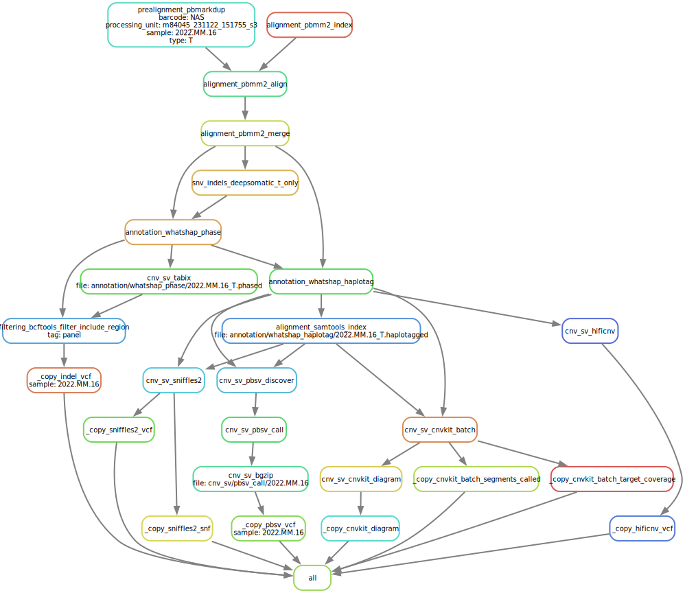

#  hydra-genetics/TwiMy

<p align="center">
<a href="https://twist-myeloma-pipeline.readthedocs.io/en/latest/"></a>Documentation on ReadTheDocs
</p>

#### Data processing


[](https://opensource.org/licenses/gpl-3.0.html)

## :speech_balloon: Introduction

TwiMy pipeline is a bioinformatic pipeline designed to analyse hybrid capture long-read (PacBio) sequencing data from the multiple myeloma gene panel.

## :heavy_exclamation_mark: Dependencies

In order to use this module, the following dependencies are required:

[](https://github.com/hydra-genetics/)
[](https://pandas.pydata.org/)
[
[](https://snakemake.readthedocs.io/en/stable/)
[](https://sylabs.io/docs/)

## :school_satchel: Preparations

### Sample data

Input data should be added to [`samples.tsv`](https://github.com/hydra-genetics/twist_myelom/blob/develop/config/samples.tsv)
and [`units.tsv`](https://github.com/hydra-genetics/twist_myelom/blob/develop/config/units.tsv).
The following information need to be added to these files:

| Column Id         | Description                                                             |
|-------------------|-------------------------------------------------------------------------|
| **`samples.tsv`** |
| sample            | unique sample/patient id, one per row                                   |
| **`units.tsv`**   | processed and raw BAM files should be in separate units files           |
| sample            | same sample/patient id as in `samples.tsv`                              |
| type              | data type identifier (one letter), can be one of **T**umor, **N**ormal  |
| platform          | type of sequencing platform, e.g. `PACBIO`                              |
| machine           | specific machine id, e.g. `Revio`                                       |
| processing_unit   | ?                                                                       |
| barcode           | sequence library barcode/index or any character string, but not `NA`    |
| methylation       | Yes/No                                                                  |
| bam               | path to BAM file                                                        |

## :white_check_mark: Testing

The workflow repository contains a small test dataset `.tests/integration` which can be run like so:

```bash
$ cd .tests/integration
$ snakemake -s ../../Snakefile --configfiles ../../config/config.yaml config/config.yaml -j1 --use-singularity
```
`../../config/config.yaml` is the original config-file, while `config/config.yaml` is the test config. By defining two config-files the latter overwrites any overlapping variables in the first config-file.
## :rocket: Usage

To use this pipeline, refer to [snakemake docs](https://snakemake.readthedocs.io/en/stable/executing/cli.html).

### Output files

The following output files should be targeted via another rule:

| File                     | Description |
|--------------------------|-------------|
| `twist_myelom/PATH/FILE` | DESCRIPTION |

## :judge: Rule Graphs


