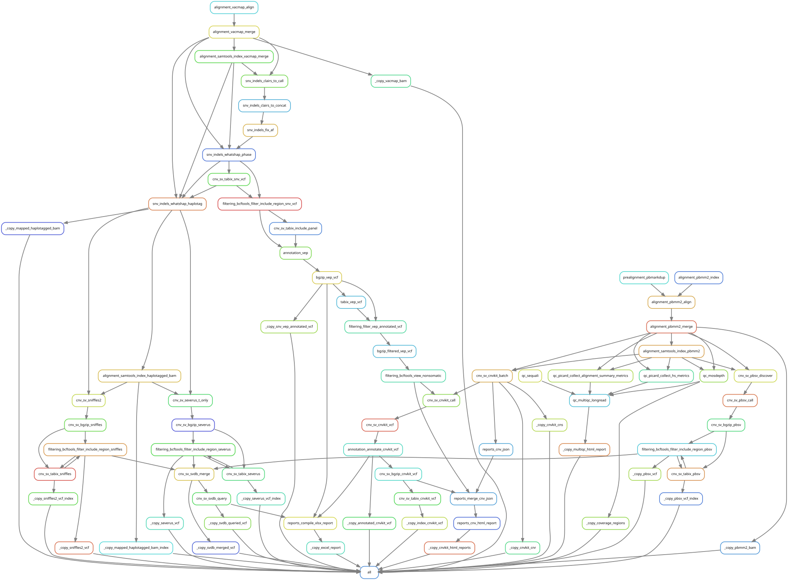

#  TwiMM

<p align="center">
<a href="https://twist-myeloma-pipeline.readthedocs.io/en/latest/">Full documentation on ReadTheDocs</a>
</p>

#### Code style validation


#### Code testing


#### License

[](https://opensource.org/licenses/gpl-3.0.html)

## :speech_balloon: Introduction

TwiMM is a bioinformatic pipeline designed to analyse hybrid capture long-read (PacBio HiFi) sequencing data from the multiple myeloma gene panel. It detects SNVs/InDels, structural variants (SV), and copy number variants (CNV). SV calling uses three callers in parallel (Severus, PBSV, Sniffles2) whose outputs are merged and annotated with population frequencies via SVDB.

## :heavy_exclamation_mark: Dependencies

All dependencies are managed by [pixi](https://pixi.sh). Install pixi, then run:

```bash
pixi install
```

This resolves and installs all required packages (Python, Snakemake, hydra-genetics, and other tools) as defined in `pixi.toml`. Container images for individual pipeline tools are pulled automatically at runtime via Singularity/Apptainer and are listed in `config/config.yaml`.

## :school_satchel: Preparations

### Sample data

Input data should be added to [`samples.tsv`](https://github.com/hydra-genetics/twist_myelom/blob/develop/config/samples.tsv)
and [`units.tsv`](https://github.com/hydra-genetics/twist_myelom/blob/develop/config/units.tsv).
The following information need to be added to these files:

| Column Id         | Description                                                             |
|-------------------|-------------------------------------------------------------------------|
| **`samples.tsv`** |
| sample            | unique sample/patient id, one per row                                   |
| **`units.tsv`**   | processed and raw BAM files should be in separate units files           |
| sample            | same sample/patient id as in `samples.tsv`                              |
| type              | data type identifier (one letter), can be one of **T**umor, **N**ormal  |
| platform          | type of sequencing platform, e.g. `PACBIO`                              |
| machine           | specific machine id, e.g. `Revio`                                       |
| processing_unit   | ?                                                                       |
| barcode           | sequence library barcode/index or any character string, but not `NA`    |
| methylation       | Yes/No                                                                  |
| bam               | path to BAM file                                                        |

## :white_check_mark: Testing

The pipeline uses [pixi](https://pixi.sh) for environment management. Run a test dry-run locally:

```bash
pixi run test-dry
```

A small test dataset is also available in `.tests/integration/`.

## :rocket: Usage

```bash
# Dry run
pixi run all-dry

# Full run (SLURM cluster)
pixi run all-full
```

Refer to [snakemake docs](https://snakemake.readthedocs.io/en/stable/executing/cli.html) for advanced usage.

### Output files

Key output files (see [full list](docs/result_files.md)):

| File | Description |
|------|-------------|
| `results/snv_indels/{sample}_T.phased.include.panel.vep_annotated.vcf.gz` | Phased SNVs/InDels annotated with VEP |
| `results/cnv_sv/svdb_query/{sample}_T.vcf` | Merged SVs annotated with population frequencies |
| `results/cnv_sv/cnvkit_vcf/{sample}_T.pathology.annotate_cnv.germline.vcf` | Annotated CNVs |
| `results/reports/html/{sample}_T.pathology.cnv_report.html` | Interactive CNV HTML report |
| `results/xlsx_reports/{sample}_T_combined_report.xlsx` | Excel report (SNV, SV, CNV + Software Versions) |

## :judge: Rule Graph


